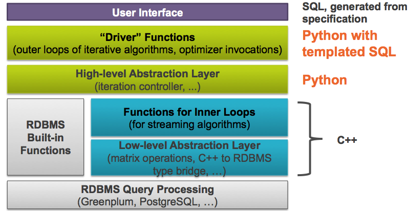

  
=================================================
**MADlib** is an open-source library for scalable in-database analytics.
It provides data-parallel implementations of mathematical, statistical and
machine learning methods for structured and unstructured data.

Installation and Contribution
==============================
See the project webpage  [`MADlib Home`](http://madlib.net) for links to the
latest binary and source packages. For installation and contribution guides,
please see [`MADlib Wiki`](https://github.com/madlib/madlib/wiki)

User and Developer Documentation
==================================
The latest documentation of MADlib modules can be found at [`MADlib
Docs`](http://doc.madlib.net) or can be accessed directly from the MADlib
installation directory by opening
[`doc/user/html/index.html`](doc/user/html/index.html).

Architecture
=============
The following block-diagram gives a high-level overview of MADlib's
architecture.

Third Party Components
======================
MADlib incorporates material from the following third-party components

1. [`argparse 1.2.1`](http://code.google.com/p/argparse/) "provides an easy, declarative interface for creating command line tools"
2. [`Boost 1.46.1 (or newer)`](http://www.boost.org/) "provides peer-reviewed portable C++ source libraries"
3. [`CERN ROOT`](http://root.cern.ch/) "is an object oriented framework for large scale data analysis"
4. [`doxypy 0.4.2`](http://code.foosel.org/doxypy) "is an input filter for Doxygen"
5. [`Eigen 3.0.3`](http://eigen.tuxfamily.org/index.php?title=Main_Page) "is a C++ template library for linear algebra"
6. [`PyYAML 3.10`](http://pyyaml.org/wiki/PyYAML) "is a YAML parser and emitter for Python"

Licensing
==========
License information regarding MADlib and included third-party libraries can be
found inside the [`license`](/license) directory.

Release Notes
=============
Changes between MADlib versions are described in the
[`ReleaseNotes.txt`](/ReleaseNotes.txt) file.

Papers and Talks
=================
* [`MAD Skills : New Analysis Practices for Big Data (VLDB 2009)`](http://db.cs.berkeley.edu/papers/vldb09-madskills.pdf)

Related Software
=================
* [`PivotalR`](https://github.com/madlib-internal/PivotalR) - PivotalR also lets
the user to run the functions of the open-source big-data machine learning
package `MADlib` directly from R.
* [`PyMADlib`](https://github.com/gopivotal/pymadlib) - PyMADlib is a python
wrapper for MADlib, which brings you the power and flexibility of python
with the number crunching power of `MADlib`.
